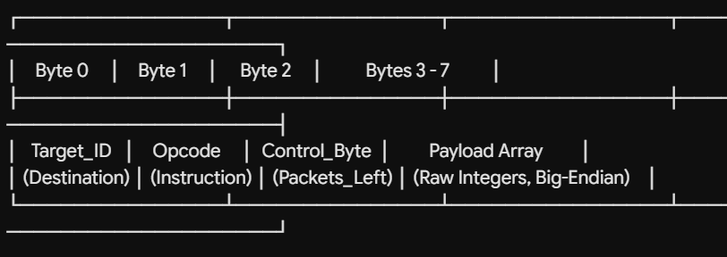

# HPCL Substation Fieldbus Protocol Specification v1.0
**Document Ref:** HPCL-R&D-SUBSTATION-BUS-V1.0  
**Target Hardware:** Central Gateway (Heltec ESP32-S3 V3) & Local Monitoring Panels (Arduino Nano + MCP2515)

---

## 1. Network Layer Configurations
* **Physical Topology:** Linear or Distributed Bus (Cat6 Shielded Twisted Pair).
* **Signal Termination:** Enforced $120\Omega$ termination resistors placed at the extreme physical boundaries of the differential line (across CAN_H and CAN_L).
* **Bitrate:** 250 KBPS (Industrial baseline tuned to mitigate extreme Electromagnetic Interference (EMI) across long substation cable paths).
* **Protocol Chipset:** MCP2515 Controller coupled with TJA1050 High-Speed Transceivers.
* **SPI Clock Frequency:** 8 MHz Oscillator Reference.

---

## 2. Definitive Address Allocation Space
The network segments standard 11-bit CAN identifiers (`can_id`) to strictly separate devices by functional profile and hardware types. This enables the Central Node to filter and run validation checks directly at the hardware mailbox layer.

| CAN Identifier Range (11-bit) | Node Classification | System Characterization |
| :--- | :--- | :--- |
| `0x000` | **Central Processing Hub** | Master Gateway Controller (Heltec Core). |
| `0x001` to `0x0A0` (1 - 160) | **Pure Telemetry LMPs** | Remote panels handling **Sensors Only** (No local actuation loops). |
| `0x0A1` to `0x0F0` (161 - 240) | **Pure Downlink Actuators** | Remote control blocks managing **Relays/Contactors Only** (Heaters, Fans, Trips). |
| `0x0F1` to `0x0FE` (241 - 254) | **Closed-Loop Hybrid Panels** | Modules combining **Sensing + Actuation** (e.g., Local breaker tracking with attached trip coil). |
| `0x0FF` (255) | **Null Pointer Flag** | Reserved globally in data tables to signal an unmapped, empty, or uninitialized loop slot. |

---

## 3. Standard Application Frame Blueprint
To prevent frame parsing lag and serialization overhead under intense EMI transients, human-readable text strings and variable-length float structures are banned from raw bus frames. All network payload transactions must conform strictly to the following 8-byte payload structure:

### Protocol Byte Breakdown:
* **Byte 0: Target Logical Address (`Target_ID`)**
  * Current Scope: Initialized to `0x00` (Routes all telemetry data straight upward to the central tracking engine).
  * Scaled Architecture Scope: Capable of mutating to any specific target LMP ID on the wire, enabling **LMP-to-LMP Peer-to-Peer Interlocking Control** without requiring gateway interaction.
* **Byte 1: Protocol Instruction ID (`Opcode`)**
  * Directs the packet directly into the matching firmware tracking engine state machine.
* **Byte 2: Control Tracking Flag (`Control_Byte`) / Segment Countdown**
  * Manages multi-segment transaction parsing. Contains the exact count of fragmented data frames remaining before stream collection finishes.
* **Bytes 3 to 7: Raw Data Block (`Payload Array`)**
  * Big-Endian byte streams containing raw integer data structures scaled by a factor of 10.

---

## 4. Global Instruction Code Matrix

| Instruction Name | Opcode Byte | Data Length (DLC) | Payload Sequence Map | Functional Operation Rules |
| :--- | :--- | :--- | :--- | :--- |
| **CMD_DISCOVER** | `0x01` | `DLC = 2` | `Byte 0: Target_ID` (Broadcast = `0x00`)  `Byte 1: 0x01` (Discover Code) | **Network Discovery Probe:** Dispatched by Gateway Node at boot to force all unlinked client units to announce themselves. |
| **RES_IDENTITY** | `0x01` | `DLC = 4` | `Byte 0: 0x00` (Gateway Target Route) `Byte 1: 0x01` (Identity Response Echo) `Byte 2: [Assigned_LMP_ID]` `Byte 3: [Group_Profile_Type]` | **Discovery Handshake Reply:** Broadcasted back by client panels to register their static profiles (`Group 1, 2, 3, or 4`) into the central database. |
| **CMD_SHIFT_MODE**| `0x02` | `DLC = 2` | `Byte 0: Target_ID` (Global = `0x00`)  `Byte 1: 0x02` (Operational Opcode) | **Operational Mode Shift:** Command from Master Node closing the discovery window and instructing panels to start streaming values. |
| **DATA_STREAM** | `0x04` | Variable (`4 to 8`) | `Byte 0: Target_ID` `Byte 1: 0x04` (Stream Opcode) `Byte 2: [PacketsLeft]`  `Byte 3-7: [Compressed Integer Bytes]` | **Telemetry Core Push Layer:** Asynchronous message push tracking engineering parameters packed into high/low byte components. |
| **CMD_REQ_RESEND**| `0x05` | `DLC = 3` | `Byte 0: Target_ID` `Byte 1: 0x05` (Fault Alert Line) `Byte 2: 0x00` (Null overhead padding) | **Stream Resend Request:** Triggered by Central Node if internal fragment countdown indices break sequence during multi-frame captures. |

---

## 5. Telemetry Group Profiles Reference (Opcode `0x04`)

### 🔹 Group 1: Single Zone Thermal Subsystem Panel
* **Functional Scope:** Local monitoring unit extracting 1x localized box ambient point and 1x targeted transformer link point temperature.
* **Payload Allocation Specs:** `DLC = 7` (Data array contains exactly 4 bytes). Fulfilled via a single terminal frame (`PacketsLeft = 0`).
* **Byte Construction Mapping:**
  * `Byte 3-4`: Remote Object Temperature (16-bit Signed Integer, Scaled $x10$, e.g., `452` matches $45.2^\circ\text{C}$).
  * `Byte 5-6`: Local Ambient Case Temperature (16-bit Signed Integer, Scaled $x10$).
* **Gateway Output Mapping:** String row converted to database text: `OBJ_T1:XX.X;CASE_AMB:XX.X`.

### 🔹 Group 2: Comprehensive Micro-Climate Panel
* **Functional Scope:** Environmental tracking node tracing thermal points alongside digital relative humidity parameters to calculate condensation threats inside switchgears.
* **Payload Allocation Specs:** `DLC = 8` (Data array contains exactly 5 bytes). Fulfilled via a single terminal frame (`PacketsLeft = 0`).
* **Byte Construction Mapping:**
  * `Byte 3-4`: Remote Object Temperature (16-bit Signed Integer, Scaled $x10$).
  * `Byte 5-6`: Local Ambient Case Temperature (16-bit Signed Integer, Scaled $x10$).
  * `Byte 7`: Relative Humidity Register (8-bit Unsigned Integer, Scaled $x2.0$. To extract physical value: divide raw byte counter by 2).
* **Gateway Output Mapping:** String row converted to database text: `OBJ_T1:XX.X;PREC_AMB:XX.X;RH:XX.X%`.

### 🔹 Group 3: Multi-Segment Differential Link Monitoring
* **Functional Scope:** Advanced substation module monitoring differential point temperatures across deep phase linkages.
* **Payload Allocation Specs:** 6 bytes total. Requires **2 back-to-back fragmented CAN frames** due to standard message array boundaries.

#### Message Fragment 1 Layout (`Control_Byte / Byte 2 = 0x01`):
* `Byte 3-4`: Zone A Object Thermal Point (16-bit Signed Integer, Scaled $x10$).
* `Byte 5-6`: Zone B Object Thermal Point (16-bit Signed Integer, Scaled $x10$).
* `Byte 7`: High Byte component of the Shared Ambient Enclosure temperature.

#### Message Fragment 2 Layout (`Control_Byte / Byte 2 = 0x00`):
* `Byte 3`: Low Byte component of the Shared Ambient Enclosure temperature (The engine stitches this byte to Fragment 1 Byte 7 to reconstruct the full 16-bit signed integer).
* `Byte 4-7`: Null padding bytes (`0x00`).
* **Gateway Output Mapping:** String row converted to database text: `PHASE_A:XX.X;PHASE_B:XX.X;SHARED_AMB:XX.X`.

### 🔹 Group 4: Remote Actuator Override Loop Array
* **Functional Scope:** High-voltage switchgear trip-coil execution strings routed from the human interface center down to target breaker coils.
* **Payload Allocation Specs:** `DLC = 6` (Data array contains 3 bytes). Directed directly to devices in address space `161–240`.
* **Byte Construction Mapping:**
  * `Byte 3`: Active Target Relay Channel Number (e.g., `1` to `8`).
  * `Byte 4`: Discrete Signal State (Strict Binary Boolean: `0x01` = Hard Energize / CLOSE, `0x00` = De-energize / OPEN).
  * `Byte 5`: Local Relay Fail-Safe Watchdog Timeout Threshold Limit (Seconds).
* **Gateway Output Mapping:** String row converted to database text: `VCB_BREAKER:STATE;AUX_FAN:STATE;FAULT_HEX:0xXX`.

---

## 6. Real-Time Processing & SPI Shared Memory Guarding (FreeRTOS)
Because the Heltec core routes its on-board Micro SD Card Reader and the external MCP2515 CAN Bus Controller chip over the **same hardware SPI peripheral instance**, the firmware handles resource access via priority-driven task barriers to prevent bus lockout and storage drops:

1. **The Shared Bus Conflict:** If the real-time CAN network task reads a frame from the transceiver at the same microsecond the storage logger appends data to flash, signal intersections occur on the `MISO` copper trace. This corrupts filesystem structures, forcing the card into an emergency safety shutdown (`SD Card Disconnected`).
2. **Mutual Exclusion Protection:** A global Mutex handle (`xStorageMutex`) is declared before the core thread generator fires.
3. **The Synchronization Sequence:**
   * **Network Task (Core 1, Priority 3 - Max):** Loops every 2ms. It attempts to grab the mutex using `xSemaphoreTake`. It queries the controller registers, copies the frame buffer, and releases the token instantly via `xSemaphoreGive`.
   * **Pipeline Dispatch:** Decoded datasets are packed into a structural footprint `StorageLogPacket` and shot into a deep, non-blocking FreeRTOS message Queue (`xStorageQueueHandle`).
   * **Storage Task (Core 1, Priority 2 - Med):** Blocks until data hits the queue. Once awakened by the kernel, it takes the mutex lock, triggers an isolated hardware line cleanup via `SPI.end()` followed by an instant `SPI.begin()`, appends to the storage block, executes a hard cache synchronization commit (`flush`), closes the file context, and yields the bus trace back to the network threads.