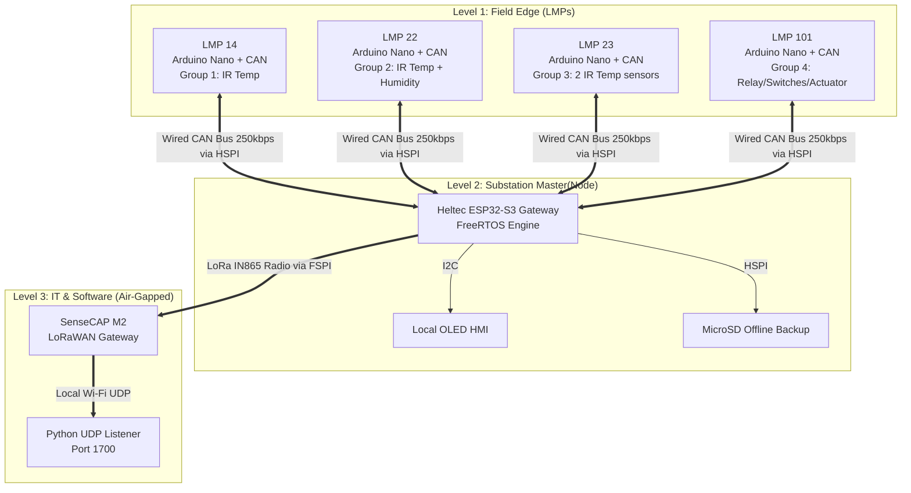

# 🏭 AgnostiLink: Open Wireless Platform for Industrial Monitoring & Automation 
*(HPCL Substation IoT Suite)*

## 📖 1. Context & Problem Statement
Large industrial facilities—such as oil refineries, supply depots, and solar farms—contain thousands of secondary components (like localized electrical panels, auxiliary motors, and switchgears) that require constant monitoring to prevent breakdowns. 

While expensive, certified vendor SCADA networks are excellent for major, highly critical infrastructure, expanding them to cover these smaller, widespread components is financially impossible due to massive wiring costs and heavy proprietary software licensing fees. Because of these high costs, many secondary assets are left in a complete **"operational blind spot"** with no automated way to track conditions, view live trends, or respond to issues from a distance. 

When field equipment fails in these unmonitored zones (e.g., an overheating transformer bushing or tracking in switchgears due to humidity), it leads to delayed maintenance, extended downtime, and severe potential safety hazards. To solve this problem, we developed **AgnostiLink**, an in-house, low-cost, and highly modular IoT platform designed to be retrofitted into existing electrical panels without disrupting core operations.

## 🎯 2. Main Aim of the Project
To design and deploy a fault-tolerant, modular edge-computing network that bridges raw physical field data to a centralized, air-gapped software dashboard. 

The system relies on a **two-tier communication architecture**:
1. **Field Electronics Layer (Wired Local Bus):** Utilizes microcontrollers (Arduino Nano Core), universal environmental sensors, and the robust **CAN (Controller Area Network)** protocol to gather data safely within high-EMI substation rooms.
2. **Wireless Security Network (Backhaul):** Utilizes long-range **LoRa** hardware modules to securely bridge the collected substation data over long distances to a centralized IT server, entirely independent of existing corporate Wi-Fi or wired IT networks.

### Core Objectives Achieved:
* **Edge-Level Acquisition:** Capture real-time object temperatures (IR sensors), ambient humidity (AHT21B), and relay statuses continuously.
* **Deterministic Fault Tolerance:** Ensure that local hardware (OLED HMI, SD Card backups) continues to function safely even if the wireless connection to the main server drops.
* **True Modularity:** Allow technicians to plug-and-play new sensors into the CAN bus without rewriting the master gateway's firmware.

---

## 🏗️ 3. High-Level System Architecture

## ✨ 4. Core Features & Engineering Innovations

The AgnostiLink ecosystem was built to survive in unforgiving industrial environments. Standard hobbyist approaches (like running all code in a single `loop()`) fail under refinery conditions. Instead, this system utilizes enterprise-grade embedded architecture.

### 🧠 4.1 Asymmetric Dual-Core Processing (FreeRTOS)
To prevent network bottlenecks and screen freezing, the ESP32-S3 Gateway runs a deeply decoupled FreeRTOS multi-threaded environment:
* **Core 0 (The Nervous System):** Exclusively dedicated to deterministic, real-time CAN bus polling, hardware interrupts, and network discovery. It never waits for slow peripherals.
* **Core 1 (The Brain):** Handles heavy lifting—LoRa AES encryption/transmission, SD Card file I/O operations, and OLED rendering.
* **Thread Safety:** Cores do not share global variables. Data is securely passed between the hardware layer and the transmission layer using **FreeRTOS Queues and Mutex Semaphores**, completely eliminating race conditions and memory corruption.

### 🔌 4.2 Deterministic Auto-Discovery & "Plug-and-Play" Expansion
The system requires zero firmware modifications when the facility expands. It utilizes a **4-Phase Boot Sequence**:
1. **Bus Flooding:** The gateway broadcasts a `CMD_DISCOVER` Opcode (`0x01`).
2. **Identity Reply:** Any connected Local Monitoring Panel (LMP) catches the broadcast and instantly replies with its unique Node ID and **Group ID**.
3. **Sequential ACK:** The gateway verifies stable bidirectional links and locks the roster.
4. **Type-Group Addressing:** The Gateway automatically knows how to parse data based on the Group ID (e.g., Group 1 = IR Temp, Group 2 = IR Temp + Humidity). To expand the substation network, a technician simply wires a new LMP to the CAN bus—the Gateway will automatically discover it, register its sensor profile, and begin logging its data.

### 📡 4.3 Industrial CAN Bus Architecture
Designed to punch through high Electromagnetic Interference (EMI) generated by massive transformers and switchgears.
* **Physical Layer:** Operates at a highly stable **250 KBPS** over twisted-pair Cat6 cabling, fortified by physical **120Ω terminating resistors** to eliminate signal reflection.
* **Bare-Metal Opcodes:** The CAN network does not waste bandwidth transmitting heavy text strings or JSON. It uses a strict, 8-byte hexadecimal Opcode payload system.
* **Hardware Arbitration:** Native to the CAN protocol, if two devices attempt to transmit at the exact same millisecond, the hardware mathematically resolves the collision. The higher-priority frame continues uninterrupted, and the lower-priority **LMP** automatically re-queues its packet. Furthermore, the Master Node is assigned the lowest CAN ID, ensuring that its critical network commands hold the absolute highest priority on the bus.
* **Hardware Buffering:** The MCP2515 controllers feature built-in silicon RX buffers. Even if the ESP32 is busy writing to the SD card, the CAN module physically catches and holds incoming telemetry, ensuring **zero dropped packets**.

### 🛠️ 4.4 Fault Tolerance & Live Bitwise Diagnostics
The system is designed with a "Fail-Safe, Auto-Recover" philosophy:
* **Sensor Hot-Swapping & Live Error Bytes:** LMPs actively monitor their $I^2C$ communication lines via hardware watchdogs. If an environmental sensor is physically unplugged or destroyed, the LMP does not crash. Instead, it utilizes a dedicated **Error Byte** where each bit represents a specific fault status. For example, a sensor failure flips `Bit 0` to `1`. This byte is continuously streamed to the Gateway. As soon as the error is physically cleared and the data stream is restored, `Bit 0` dynamically restores to `0`. (The remaining bits are left open for future diagnostic expansion).
* **SD Card Hot-Unplug Protection:** If the MicroSD card is ejected while the system is live, the FreeRTOS Storage Engine instantly detects the missing hardware, suspends file I/O to prevent a fatal OS panic, alerts the OLED HMI, and continuously polls the SPI bus until a card is re-inserted and successfully remounted.
* **Digital Circuit Breakers:** Code is wrapped in `configASSERT()` checkpoints to instantly catch memory leaks or stack overflows during long-term continuous operation.

### 🔀 4.5 Intelligent SPI Hardware Isolation
The ESP32-S3 contains limited hardware SPI buses. To prevent peripheral collisions, AgnostiLink implements strict bus routing:
* **Bus 1 (FSPI):** Pin-locked and strictly dedicated to the SX1262 LoRa Radio. This prevents the complex, time-sensitive RF modulation from ever being interrupted.
* **Bus 2 (HSPI):** Safely shared between the MCP2515 CAN Controller and the MicroSD Card reader. Using ESP32 SPI Transactions and Chip Select (CS) logic, FreeRTOS seamlessly hands the bus back and forth between network polling and file-saving operations in microseconds.

### 🕹️ 4.6 Bi-Directional Control & "Newbie-Proof" HMI
The system is not just a passive listener; it is a full command-and-control suite.
* **Substation UI:** A built-in 128x64 OLED display utilizing a lag-free, double-buffered rendering engine. It features a 5-button tactile interface (Up, Down, Enter, Back, Home) driven by a strict State Machine.
* **Global Emergency Overrides:** No matter how deep a user navigates into the settings menu to adjust polling intervals, if a critical Level-2 temperature spike occurs on the CAN bus, the UI immediately hijacks the screen to flash a localized Danger Tag.
* **Actuator Downlink:** The network architecture reserves specific Node IDs (161–240) for Actuators. The central IT server can dispatch AES-encrypted command payloads back down the LoRa pipeline. The Gateway decrypts these, translates them into `CMD_ACTUATE` CAN Opcodes, and directs specific LMPs to toggle their onboard relay control circuits—completing the loop from cloud dashboard to physical edge device.
