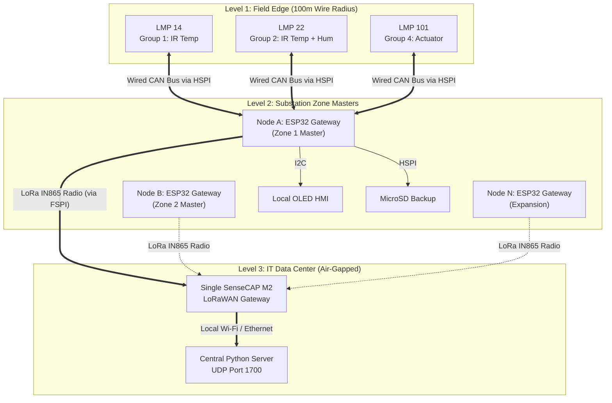
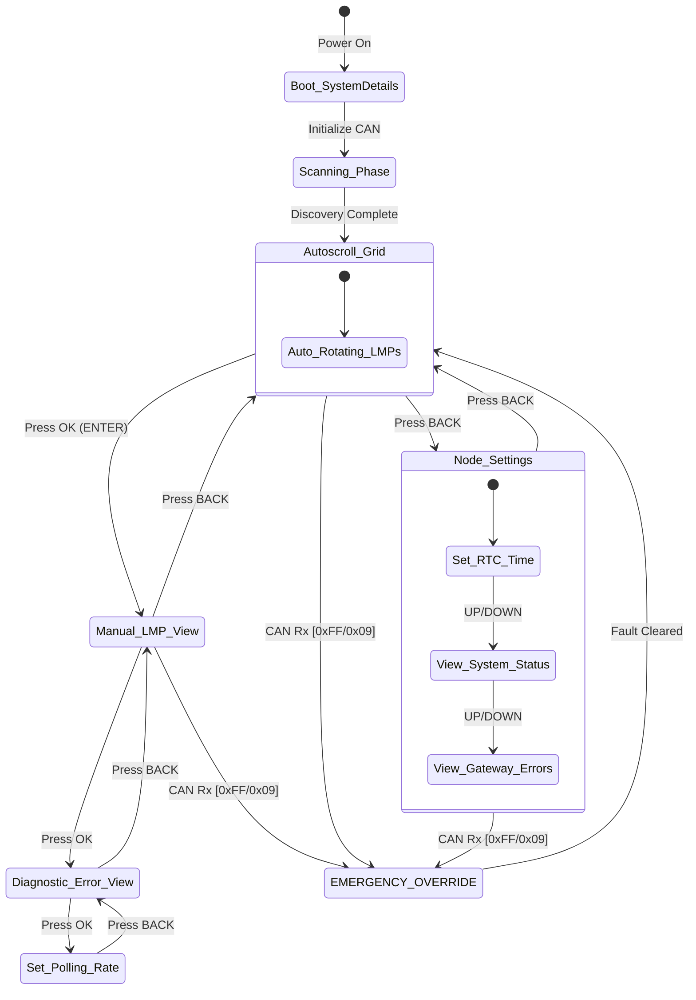

# 🏭 AgnostiLink: Open Wireless Platform for Industrial Monitoring & Automation 
*(HPCL Substation IoT Suite)*


### 🌿 Repository Branching Strategy
To maintain industrial reliability while allowing for continuous R&D, this repository operates on a strict two-branch system:
* **`main` (Stable):** The production-ready branch. Contains the battle-tested, core features (FreeRTOS multi-threading, AL-CAN discovery and communication, SD card data loging, UI, LoRa). Highly stable, but limited to foundational features.
* **`work-in-progress` (Experimental):** The active development branch. Contains the absolute latest features, UI overhauls, and experimental sensor profiles. *Note: Code on this branch is subject to rapid changes and may contain bugs, memory leaks, or stability issues.*

---

## 📖 1. Context & Problem Statement
Large industrial facilities—such as oil refineries, supply depots, and solar farms—contain thousands of secondary components (like localized electrical panels, auxiliary motors, and switchgears) that require constant monitoring to prevent breakdowns. 

While expensive, certified vendor SCADA networks are excellent for major, highly critical infrastructure, expanding them to cover these smaller, widespread components is financially impossible due to massive wiring costs and heavy proprietary software licensing fees. Because of these high costs, many secondary assets are left in a complete **"operational blind spot"** with no automated way to track conditions, view live trends, or respond to issues from a distance. 

When field equipment fails in these unmonitored zones (e.g., an overheating transformer bushing or tracking in switchgears due to humidity), it leads to delayed maintenance, extended downtime, and severe potential safety hazards. To solve this problem, we developed **AgnostiLink**, an in-house, low-cost, and highly modular IoT platform designed to be retrofitted into existing electrical panels without disrupting core operations.

## 🎯 2. Main Aim of the Project
To design and deploy a fault-tolerant, modular edge-computing network that bridges raw physical field data to a centralized, air-gapped software dashboard. 

The system relies on a **two-tier communication architecture**:
1. **Field Electronics Layer (Wired Local Bus):** Utilizes microcontrollers (Arduino Nano Core), universal industrial environmental sensors, and the robust **CAN (Controller Area Network)** protocol to gather data safely within high-EMI substation rooms.
2. **Wireless Security Network (Backhaul):** Utilizes long-range **LoRa** hardware modules to securely bridge the collected substation data over long distances to a centralized IT server, entirely independent of existing corporate Wi-Fi or wired IT networks.

### Core Objectives Achieved:
* **Edge-Level Acquisition:** Capture real-time object temperatures (IR sensors), ambient humidity (AHT21B), and relay statuses continuously.
* **Deterministic Fault Tolerance:** Ensure that local hardware (OLED HMI, SD Card backups) continues to function safely even if the wireless connection to the main server drops.
* **True Modularity:** Allow technicians to plug-and-play new sensors into the CAN bus without rewriting the master gateway's firmware.

---

## 🏗️ 3. System Architecture & Physical Topology


AgnostiLink is designed to scale spatially across massive industrial campuses without requiring complex IT infrastructure or Wi-Fi mesh networks. The deployment topology is divided into three distinct physical layers:

### 📍 3.1 The Deployment Strategy
* **The 100-Meter CAN Cell:** The physical CAN bus is highly robust but distance-constrained by electrical resistance. Therefore, **one Master Node (ESP32 Gateway)** is deployed to act as the localized hub for multiple equipment LMPs clustered within a maximum **100-meter radius**. 
* **Substation Scalability:** A small switchyard may only require a single Node. However, a massive refinery substation can deploy multiple independent Nodes (e.g., Node A for the North Transformer Bank, Node B for the South Motor Control Center), with each Node managing its own localized 100m CAN network.
* **The Wireless Funnel:** Regardless of whether a facility has 1 Node or 50 Nodes, **all of them broadcast wirelessly to a single, centralized LoRaWAN Gateway** (SenseCAP M2). This completely eliminates the need to run kilometers of fiber-optic cable back to the main server room.


### 🗺️ 3.2 Network Flow Diagram



## ✨ 4. Core Features & Engineering Innovations

The AgnostiLink ecosystem was built to survive in unforgiving industrial environments. Standard hobbyist approaches (like running all code in a single `loop()`) fail under refinery conditions. Instead, this system utilizes enterprise-grade embedded architecture.

### 🧠 4.1 Asymmetric Dual-Core Processing (FreeRTOS)
To prevent network bottlenecks and screen freezing, the ESP32-S3 Gateway runs a deeply decoupled FreeRTOS multi-threaded environment:
* **Core 0 (The Nervous System):** Exclusively dedicated to deterministic, real-time CAN bus polling, hardware interrupts, and network discovery. It never waits for slow peripherals.
* **Core 1 (The Brain):** Handles heavy lifting—LoRa AES encryption/transmission, SD Card file I/O operations, and OLED rendering.
* **Thread Safety:** Cores do not share global variables. Data is securely passed between the hardware layer and the transmission layer using **FreeRTOS Queues and Mutex Semaphores**, completely eliminating race conditions and memory corruption.

### 🔌 4.2 Deterministic Auto-Discovery & "Plug-and-Play" Expansion
The system requires zero firmware modifications when the facility expands. It utilizes a **4-Phase Boot Sequence**:
1. **Bus Flooding:** The gateway broadcasts a `CMD_DISCOVER` Opcode (`0x01`).
2. **Identity Reply:** Any connected Local Monitoring Panel (LMP) catches the broadcast and instantly replies with its unique Node ID and **Group ID**.
3. **Sequential ACK:** The gateway verifies stable bidirectional links and locks the roster.
4. **Type-Group Addressing:** The Gateway automatically knows how to parse data based on the Group ID (e.g., Group 1 = IR Temp, Group 2 = IR Temp + Humidity). To expand the substation network, a technician simply wires a new LMP to the CAN bus—the Gateway will automatically discover it, register its sensor profile, and begin logging its data.

_Click the image below to watch multi-LMP detection on CAN bus._
<p align="center">
  <a href="https://youtube.com/shorts/Hb-BoFzUOH0?feature=share">
    
  </a>
</p>

### 📡 4.3 Industrial CAN Bus Architecture
Designed to punch through high Electromagnetic Interference (EMI) generated by massive transformers and switchgears.
* **Physical Layer:** Operates at a highly stable **250 KBPS** over twisted-pair Cat6 cabling, fortified by physical **120Ω terminating resistors** to eliminate signal reflection.
* **Bare-Metal Opcodes:** The CAN network does not waste bandwidth transmitting heavy text strings or JSON. It uses a strict, 8-byte hexadecimal Opcode payload system.
* **Hardware Arbitration:** Native to the CAN protocol, if two devices attempt to transmit at the exact same millisecond, the hardware mathematically resolves the collision. The higher-priority frame continues uninterrupted, and the lower-priority **LMP** automatically re-queues its packet. Furthermore, the Master Node is assigned the lowest CAN ID, ensuring that its critical network commands hold the absolute highest priority on the bus.
* **Hardware Buffering:** The MCP2515 controllers feature built-in silicon RX buffers. Even if the ESP32 is busy writing to the SD card, the CAN module physically catches and holds incoming telemetry, ensuring **zero dropped packets**.

### 🛠️ 4.4 Fault Tolerance & Live Bitwise Diagnostics
The system is designed with a "Fail-Safe, Auto-Recover" philosophy:
* **Sensor Hot-Swapping & Live Error Bytes:** LMPs actively monitor their I2C communication lines via hardware watchdogs. If an environmental sensor is physically unplugged or destroyed, the LMP does not crash. Instead, it utilizes a dedicated **Error Byte** where each bit represents a specific fault status. For example, a sensor failure flips `Bit 0` to `1`. This byte is continuously streamed to the Gateway. As soon as the error is physically cleared and the data stream is restored, `Bit 0` dynamically restores to `0`. 
* **SD Card Hot-Unplug Protection:** If the MicroSD card is ejected while the system is live, the FreeRTOS Storage Engine instantly detects the missing hardware, suspends file I/O to prevent a fatal OS panic, alerts the OLED HMI, and continuously polls the SPI bus until a card is re-inserted and successfully remounted.
* **Digital Circuit Breakers:** Code is wrapped in `configASSERT()` checkpoints to instantly catch memory leaks or stack overflows during long-term continuous operation.

_Click the image below to watch node menu and LMP related features._
<p align="center">
  <a href="https://youtu.be/4uiYQzbxTEU">
    
  </a>
</p>

### 🔀 4.5 Intelligent SPI Hardware Isolation
The ESP32-S3 contains limited hardware SPI buses. To prevent peripheral collisions, AgnostiLink implements strict bus routing:
* **Bus 1 (FSPI):** Pin-locked and strictly dedicated to the SX1262 LoRa Radio. This prevents the complex, time-sensitive RF modulation from ever being interrupted.
* **Bus 2 (HSPI):** Safely shared between the MCP2515 CAN Controller and the MicroSD Card reader. Using ESP32 SPI Transactions and Chip Select (CS) logic, FreeRTOS seamlessly hands the bus back and forth between network polling and file-saving operations in microseconds.

### 🕹️ 4.6 Bi-Directional Control & "Newbie-Proof" HMI
The system is not just a passive listener; it is a full command-and-control suite.
* **Substation UI:** A built-in 128x64 OLED display utilizing a lag-free, double-buffered rendering engine. It features a 5-button tactile interface (Up, Down, Enter, Back, Home) driven by a strict State Machine.
* **Global Emergency Overrides:** No matter how deep a user navigates into the settings menu to adjust polling intervals, if a critical Level-2 temperature spike occurs on the CAN bus, the UI immediately hijacks the screen to flash a localized Danger Tag.
* **Actuator Downlink:** The network architecture reserves specific Node IDs (161–240) for Actuators. The central IT server can dispatch AES-encrypted command payloads back down the LoRa pipeline. The Gateway decrypts these, translates them into `CMD_ACTUATE` CAN Opcodes, and directs specific LMPs to toggle their onboard relay control circuits—completing the loop from cloud dashboard to physical edge device.

## 🖧 5. The AgnostiLink CAN Protocol (AL-CAN)

At the heart of the field network is a custom, bare-metal implementation of the Controller Area Network (CAN 2.0A) standard. To maximize efficiency and ensure deterministic performance under heavy loads, we bypassed text-heavy protocols (like JSON) and built the **AL-CAN Protocol**: a strict, byte-level quantization and multi-frame assembly standard.

### 📡 5.1 Network Addressing & Hardware Limits
The system uses standard 11-bit CAN Identifiers. Addressing is asymmetrical and physically prioritized. In CAN physics, lower IDs overwrite higher IDs on the electrical wire during collisions.

* **Master Gateway (ESP32-S3):** Hardcoded to **CAN ID `0x00`**. This ensures that network-critical commands (Discovery, Actuation, Resend Requests) possess absolute priority over the bus and cannot be delayed by sensor telemetry.
* **Telemetry LMPs (Sensors):** Assigned CAN IDs from **`0x01` to `0xA0` (1–160)**.
* **Actuator LMPs (Relays/Switches):** Assigned CAN IDs from **`0xA1` to `0xF0` (161–240)**.
* **Network Capacity:** The 1-byte addressing naturally allows for **240 active LMPs** per substation bus. 

---

### 📦 5.2 Dynamic Payload Structure & Multi-Frame Assembly
A fundamental constraint of standard CAN is that a single frame can only hold **8 Bytes** of data. However, our LMPs often generate larger payloads (e.g., dual-phase temperatures, humidity, and error masks). 

To solve this, AL-CAN implements a **Fragmented Multi-Frame Assembly Line** (`LMPAssemblyBuffer`). Instead of cramming data, the protocol dynamically shifts the meaning of the bytes based on the Instruction ID (Opcode). 

#### The Standard AL-CAN 8-Byte Frame Map:
| Byte | Field | Description / Context |
| :--- | :--- | :--- |
| **0** | `TARGET/SENDER_ID` | The Node ID targeted by the Master, or the LMP ID replying (0–240). |
| **1** | `INSTRUCTION_ID` | The Opcode (See 5.3). Defines the exact behavior of the frame. |
| **2** | `CONTEXT_BYTE_1` | Varies: `Packets Left` (0x04) / `Error Mask` (0x06) / `Poll Rate High` (0x07). |
| **3** | `CONTEXT_BYTE_2` | Varies: `Group Type` (0x01) / `Poll Rate Low` (0x07) / `Data Chunk` (0x04). |
| **4** | `DATA_0` | Fragmented payload chunk. |
| **5** | `DATA_1` | Fragmented payload chunk. |
| **6** | `DATA_2` | Fragmented payload chunk. |
| **7** | `DATA_3` | Fragmented payload chunk. |

#### How Data Larger Than 8 Bytes is Handled:
When an LMP sends telemetry (Opcode `0x04`), **Byte 2 acts as a reverse counter (`packetsLeft`)**.
1. The Gateway receives the first frame, sees `packetsLeft > 0`, and opens a 32-byte staging buffer in RAM (`assemblyLine[NodeID]`).
2. It strips Bytes 3 through 7 and writes them into the buffer (`session.bytesWritten`).
3. As subsequent frames arrive, it appends the new data chunks.
4. When a frame arrives with `packetsLeft == 0`, the Gateway locks the buffer, extracts the complete industrial CSV string, and executes the save/transmit logic.

---

### 🎛️ 5.3 The Instruction Set (Opcodes)
Byte 1 acts as the network router. The protocol supports up to 255 distinct commands. The current firmware state machine utilizes the following:

* `0x01` **[CMD_DISCOVER]:** Phase 1 Boot broadcast. Prompts LMPs to reply with their hardware Group Type.
* `0x02` **[CMD_SHIFT_MODE]:** Broadcasted by the Gateway to signal the end of the Discovery Phase and transition the network to Operational Listening.
* `0x04` **[DATA_STREAM]:** The standard multi-frame payload containing continuous sensor telemetry.
* `0x05` **[CMD_REQ_RESEND]:** Gateway command targeting a specific LMP to retransmit a dropped/corrupted multi-frame packet (Triggered by the Assembly Line).
* `0x06` **[CMD_REQ_DIAG]:** Gateway command forcing an LMP to bypass standard polling and instantly report its live Error Mask.
* `0x07` **[CMD_SET_POLL]:** Downlink command to change an LMP's physical polling speed. Bytes 2 & 3 contain the new interval.
* `0x09` **[CMD_PANIC]:** Emergency override broadcasted by an LMP if it detects an immediate hardware or environmental failure (`0xFF` error state).
* `0x0A` **[CMD_GET_POLL]:** Gateway command querying the LMP's current confirmed polling rate to sync the OLED HMI settings.

---

### 🧩 5.4 Group Profiles & Telemetry Parsing
Once the `DATA_STREAM` frames are completely assembled in RAM, the Gateway references the `GROUP_ID` it logged during the `0x01` Discovery Phase to decode the raw bytes. This ensures the Master Gateway never needs to be re-flashed when new LMPs are added.

The system supports up to **255 hardware profiles**. Currently deployed formats:

* **Group 1 (Standard IR Temp):**
  * Parses 4 bytes. 
  * Unpacks as: `OBJ1: XX.X; AMB: XX.X`
* **Group 2 (IR Temp + Humidity):**
  * Parses 5 bytes. 
  * Unpacks as: `OBJ1: XX.X; AMB: XX.X; RH: XX.X%`
* **Group 3 (Dual-Phase IR Temp):**
  * Parses 6 bytes. 
  * Unpacks as: `PHASE_A: XX.X; PHASE_B: XX.X; SHARED_AMB: XX.X`
* **Group 4 (Actuators / Switches):**
  * Parses 1 byte (Hex Mask).
  * Unpacks as: `ACTUATOR_MASK: 0xXX`

---

### 🛡️ 5.5 Multi-Tier Dropped Packet Recovery
Industrial substations generate massive electrical noise, which usually destroys Wi-Fi or I2C signals. The AL-CAN network guarantees data delivery through three layers of physical and software protection:

1. **Hardware Arbitration (CSMA/CR Layer):**
   CAN bus utilizes Carrier Sense Multiple Access with Collision Resolution. If LMP 14 and LMP 22 attempt to transmit telemetry at the exact same millisecond, the MCP2515 transceivers physically negotiate the line. The lower ID wins, and the losing LMP automatically holds its frame in a silicon buffer, re-transmitting the exact microsecond the line goes quiet.
2. **Missing Fragment Detection (Software Layer):**
   If a massive EMI spark destroys a specific fragment of a multi-frame `DATA_STREAM` transmission, the ESP32 Gateway's `LMPAssemblyBuffer` catches the discrepancy via the `expectedNextCount` tracking logic. 
3. **Targeted Resend (`CMD_REQ_RESEND`):**
   Upon detecting a dropped frame, the Gateway suspends parsing, issues Opcode `0x05` to the specific LMP, and increments a `retryCounter`. The LMP is allowed up to `MAX_RETRIES_ALLOWED` (3 attempts) to complete the multi-frame transfer before the Gateway flushes the corrupted buffer and moves on to the next task.


## 🖥️ 6. Industrial HMI & Local UI Architecture

In high-stress industrial environments, a field operator needs to read critical substation data in seconds without getting lost in complex menus. To achieve this, the AgnostiLink Gateway features a fully integrated **Human-Machine Interface (HMI)** driven by a deterministic FreeRTOS State Machine.

### 📟 6.1 Hardware & Double-Buffered Display Engine
* **Display:** 0.96-inch 128x64 monochrome OLED communicating via I2C.
* **Lag-Free Double-Buffering:** Standard microcontroller displays write pixel-by-pixel directly to the screen, causing a visible top-to-bottom "tearing" or "flicker" effect every time a sensor updates. We bypassed this by allocating a dedicated frame-buffer in the ESP32's RAM. The FreeRTOS UI task constructs the entire graphical frame invisibly in memory, and then blasts the completed frame to the OLED in a single high-speed burst. The result is a buttery-smooth, flicker-free industrial display.
* **EMI Resilience (`Vext` Control):** Substations experience massive electromagnetic spikes that can physically freeze I2C OLED screens. By routing power through the ESP32-S3's `Vext` transistor, FreeRTOS can cleanly cut power to the screen and hard-reboot the display driver without resetting the main network processor, maintaining 100% CAN uptime.

### 🕹️ 6.2 Breadcrumb Navigation & The 5-Button State Machine
To keep the system "Newbie-Proof", we avoided touchscreens (which fail when operators wear heavy PPE gloves). Instead, navigation is handled by a 5-button tactile array mapped to hardware interrupts. 

The UI employs a **Breadcrumb Architecture** (e.g., `[SYS > LMP 14 > ERR]`). This constant top-bar visual anchor ensures operators always know exactly how deep they are in the menu hierarchy and what they are currently editing.

---

### 🗺️ 6.3 The Deep Menu Hierarchy

The interface strictly follows a logical flow to mimic professional SCADA HMIs:

#### **Phase 1: Boot & Auto-Discovery**
* **System Details Screen:** Upon power-up, the system displays the HPCL branding, firmware version, and core hardware checks to validate system integrity.
* **Scanning Page:** The display shifts to a dynamic progress screen during the CAN Bus Discovery Phase, showing the network actively flooding the bus and locking in the addresses of connected LMPs.

#### **Phase 2: Operational Monitoring**
* **The Auto-Scrolling Grid:** Once discovery is complete, the UI defaults to an automated, rotating view of all active LMPs. This allows a technician to monitor the entire substation hands-free.

#### **Phase 3: Deep-Dive & Manual Control**
If an operator notices an anomaly on the Auto-Scrolling screen, they can intervene using the 5-button array:
* **Manual Mode (Press `OK`):** Pauses the auto-scroll. The operator can now manually cycle through specific LMPs using the `UP` and `DOWN` buttons to observe live telemetry.
* **Diagnostic View (Press `OK` again):** Dives into the selected LMP's **Error Byte**. The UI decodes the bitmask, instantly telling the operator if the node is healthy or suffering from specific faults (e.g., an unplugged I2C sensor wire).
* **Network Override (Press `OK` again):** Enters the Configuration State. The operator can dynamically adjust the CAN bus polling interval for this specific LMP, ranging from aggressive (2.5 seconds) to passive (60 seconds) depending on monitoring needs.

#### **Phase 4: Node Master Settings**
Pressing `BACK` from the main Auto-Scrolling page brings the operator into the Master Gateway's configuration menu:
1. **Clock Configuration:** Manually synchronize the internal RTC Date & Time for accurate SD card logging.
2. **System Health Status:** A live readout of the Master Gateway's internal peripherals (SD Card mount status, LoRa Radio link status, CAN Bus health, and RTC health).
3. **Master Error Byte:** Displays the localized diagnostic byte for the ESP32 Gateway itself.

---

### 🚨 6.4 The Global Emergency Override
Safety is the absolute highest priority. The `isEmergencyActive` boolean check sits at the absolute top of the FreeRTOS UI drawing loop. 

**No matter how deep an operator is in the settings menu, a critical fault instantly hijacks the screen to flash a localized Danger Tag (e.g., `CRITICAL FAULT: NODE 14`).** The screen remains locked in this highly visible strobe state until the physical error is cleared and the LMP restores its nominal Error Mask bit to `0`.

---

### 📊 UI Flowchart



## 🎛️ 7. Edge Hardware: The Local Monitoring Panel (LMP) Firmware

While the ESP32 Master Gateway handles complex routing and LoRa transmission, the actual data acquisition happens at the extreme edge: the **Local Monitoring Panels (LMPs)**. 

Each LMP is powered by an 8-bit Arduino Nano. In standard hobbyist code, an Arduino relies heavily on `delay()` functions and crashes entirely if an I2C sensor is unplugged. To survive in a high-EMI substation, the LMP firmware was engineered with a **Non-Blocking, Self-Healing, and Preprocessor-Driven Architecture**.

### 🧱 7.1 The Asynchronous "Bare-Metal" Loop
The Arduino Nano lacks the RAM to run FreeRTOS. Instead, `lmp_code.ino` utilizes a highly disciplined, event-driven `loop()` structure.

* **Zero `delay()` Tolerance:** The code never uses blocking delays. The processor rapidly cycles, continuously polling the MCP2515 CAN controller. This ensures that incoming opcodes (like the `0x09` Emergency Stop or `0x07` Set Poll Rate) are serviced instantaneously.
* **Dynamic Background Timers:** Sensor polling and CAN transmissions operate on independent timers (`telemetryInterval`). An operator can send a CAN command to change this interval from 4000ms to 1000ms on the fly, and the Nano will seamlessly adjust its telemetry output rate without dropping a single CAN frame.

### 🛡️ 7.2 Hardware Watchdogs & "Self-Healing" Logic
Industrial sensors placed on vibrating motors or high-voltage transformers are prone to physical wire degradation. The LMP firmware is designed to survive catastrophic hardware failures automatically.

1. **The I2C Freeze Trap (`Wire.setWireTimeout`):** Standard Arduino `Wire.h` libraries will infinitely loop (hang the entire processor) if an I2C device loses power during a transmission. We implemented `Wire.setWireTimeout(25000, true);` in the `init()` block. If a sensor line is severed, the Nano forces the hardware to abort the electrical operation after 25ms, saving the networking loop from a fatal freeze.
2. **The "Self-Healing" `refresh()` Cycle:** Before every reading, the LMP checks its `global_error_register`. 
   * **If Healthy (Bit = 0):** It reads the sensor. If the reading returns a fault, it sets the error bit to `1`, zeroes out the payload to prevent transmitting stale data (`panel_obj1 = 0.0f`), and alerts the network.
   * **If Faulted (Bit = 1):** It bypasses the read logic and actively attempts to re-initialize the sensor (`MLX_sens::initMLX()`). If a technician plugs the broken wire back in, the initialization succeeds, the LMP clears the error bit (`0`), and telemetry resumes automatically—no system reboot required.

---

### 🔌 7.3 True Modularity via Preprocessor Compilation
One of the primary goals of AgnostiLink was to allow future engineers to deploy new sensor profiles without having to understand or rewrite the complex CAN networking logic.

We achieved this by utilizing **C++ Preprocessor Directives** (`#if`, `#elif`) inside `LMP_Hardware.cpp`.

#### How to Configure an LMP Profile:
The core networking code (`LMP_code.ino`) is completely blind to what hardware is attached. It merely calls `LMP_Hardware::refresh()` and `LMP_Hardware::sendStream()`. 

To configure a blank Arduino Nano to act as a specific sensor node, a technician only needs to change two lines in `LMP_Hardware.h`:
```cpp
#define LMP_ID       14   // Set the physical CAN ID
#define LMP_GROUP    2    // Set the Hardware Profile (1=IR, 2=IR+Hum, 3=Dual IR, 4=Actuator)
```
Because of the `#if (LMP_GROUP == 2)` directives in the `.cpp` file, the Arduino compiler will entirely ignore the code for Groups 1, 3, and 4. It will only compile the specific I2C libraries, memory allocations, and payload bit-shifting math required for Group 2.

**The Result:**
* **Rapid Deployment:** A junior technician can deploy a new sensor node in 30 seconds simply by changing two numbers in the header file.
* **SRAM Protection:** The Arduino Nano’s tiny 2KB SRAM is protected because it only ever holds the exact libraries and variables it needs for its assigned task.
* **Infinite Expandability:** Expanding the system to include a new "Group 5" (e.g., Vibration Sensors) simply requires adding a new `#elif (LMP_GROUP == 5)` block, leaving the mission-critical CAN loop completely untouched.

## 🏆 8. Milestones Achieved (Current State of the System)

The physical hardware and firmware layers of AgnostiLink are currently **100% operational and stable**. The system has successfully bridged the gap between raw edge physics and high-level IT ingestion.

### 🟢 Phase 1: Edge Acquisition (Completed)
* [x] Engineered a non-blocking, bare-metal Arduino Nano architecture capable of polling I2C sensors without `delay()`.
* [x] Developed the AL-CAN custom protocol, featuring Opcode routing, bit-shifted quantization, and multi-frame assembly.
* [x] Implemented hardware watchdogs and live bitwise Error Masks to enable sensor hot-swapping and "Self-Healing" node recovery.

### 🟢 Phase 2: Gateway & FreeRTOS Architecture (Completed)
* [x] Configured the ESP32-S3 as a deterministic CAN Master, featuring automated Node Discovery (`0x01`).
* [x] Deployed asymmetric dual-core processing (Core 0: Network Polling, Core 1: File I/O, UI, and Radio).
* [x] Built a lag-free, double-buffered OLED HMI utilizing a 5-button state machine and strict Breadcrumb navigation.
* [x] Engineered shared hardware SPI (HSPI) for the MCP2515 CAN module and the MicroSD card logger, including Hot-Unplug detection.
* [x] Implemented High-Resolution Millisecond timestamping and SD-Card Batch-Writing to protect flash memory lifespan.

### 🟢 Phase 3: Wireless Backhaul & Ingestion (Completed)
* [x] Re-routed internal ESP32 FSPI pins to unlock the Heltec's onboard SX1262 LoRa radio for long-range transmission.
* [x] Embedded military-grade **AES-128 (CBC mode)** encryption into the FreeRTOS transmission task to secure the airwaves against local interception.
* [x] Configured a SenseCAP M2 Gateway to bypass cloud whitelists and directly forward local UDP packets.
* [x] Wrote a centralized Python listener (`lora_listener.py`) to catch UDP packets, strip network headers, decode Base64, decrypt the AES-128 payload using `pycryptodome`, and extract clean industrial CSV data strings.


---

## 🚀 9. Future Expansions & Commercial Integrations (The Hackathon Roadmap)

Because the hardware edge layer outputs flawlessly structured, securely encrypted CSV/JSON data, the AgnostiLink network serves as the perfect foundation for enterprise-level software integrations. Future development will leverage commercial Software, AI, and RPA (Robotic Process Automation) systems:

### 🧠 9.1 Predictive Maintenance & AI Integration
Instead of functioning purely as a reactive alarm system, the continuous stream of deterministic field data allows for immediate integration with commercial AI platforms (e.g., AWS IoT Analytics, Azure Digital Twins, or custom models via `Scikit-Learn` / `TensorFlow`).
* **Anomaly Detection Models:** Machine learning models (like Isolation Forests or Autoencoders) can be trained on the historical thermal deltas between Phase A and Phase B of a transformer.
* **Micro-Degradation Tracking:** The AI can detect subtle tracking currents or humidity-induced temperature rises weeks before they trigger a hard SCADA threshold alarm, generating an "Asset Health Score" and alerting the maintenance department well in advance of a failure.

### 🌐 9.2 The "TwinLink" Digital Dashboard
The Python UDP listener natively pipes decrypted incoming data directly into a local Time-Series Database (such as PostgreSQL or InfluxDB). A full-stack web application (built via Streamlit, React, or Grafana) will be deployed as the visual operator interface. This allows plant managers to view dynamic graphs, live Node topologies, and historical thermal trends from any device on the secure corporate intranet.

### ⚡ 9.3 Secure Enterprise Downlink Control
While the LMPs currently support Opcode `0x0A` (Actuate) via the physical OLED, this architecture natively supports remote web-based execution. Shift engineers will be able to securely dispatch AES-encrypted command payloads from the web dashboard. The Gateway receives these over LoRa, decrypts them, and directs specific LMPs to toggle their onboard relay control circuits—closing the loop from the cloud down to the physical edge actuator.

### 🤖 9.4 Robotic Process Automation (UiPath) Integration
To eliminate the overhead of manual data entry, the AgnostiLink data pipeline is designed to directly trigger enterprise software bots. If the gateway logs a critical `0x09` [CMD_PANIC] opcode or a Level-2 thermal anomaly, it can fire a webhook to a commercial **UiPath Orchestrator**. 
The UiPath bot can automatically:
1. Log into the corporate SAP PM (Plant Maintenance) module.
2. Generate a structured Work Order/Notification using the exact asset ID and temperature reading.
3. Automatically email the shift supervisor with the generated ticket number.
*This completely automates the fault-to-ticket lifecycle with zero human interaction.*

### 🔌 9.5 Hardware Sensor Expansion
Because of the preprocessor-driven modularity in `LMP_Hardware.cpp`, integrating entirely new industrial sensors requires zero changes to the complex CAN or FreeRTOS loops. Future development teams can easily snap in:
* **Group 5:** Vibration Analysis (Accelerometers on high-speed motors to predict bearing wear).
* **Group 6:** Gas Detection (MQ-series sensors for localized methane or hydrogen leaks).
* **Group 7:** Power Quality Monitoring (CT clamps for phase load balancing).

---

## 🛠️ 10. Tech Stack & Compilation Guide

**Hardware Required:**
* Master: Heltec WiFi LoRa 32 (V3) [ESP32-S3 + SX1262]
* Nodes: Arduino Nano (ATmega328P)
* Transceivers: MCP2515 + TJA1050 CAN Modules
* Gateway: SenseCAP M2 LoRaWAN Gateway (or similar UDP Packet Forwarder)
* Sensors: MLX90614 (IR), AHT21B (Humidity/Temp)
  


**Firmware Dependencies (Install via Arduino Library Manager):**
* `FreeRTOS` (Native to ESP32 Arduino Core)
* `RadioLib` by Jan Gromeš (For SX1262 LoRa control)
* `mcp2515` by Autowp (For CAN bus communication)
* `Adafruit_SSD1306` & `Adafruit_GFX` (For OLED rendering)
* `Adafruit_MLX90614` & `Adafruit_AHTX0` (For LMP sensors)

**How to Run the Ingestion Server:**
1. Connect the PC to the same local network as the SenseCAP Gateway.
2. Ensure the SenseCAP is configured to forward UDP packets to your PC's IP on port `1700`.
3. Ensure the Python environment has the decryption and networking packages:
   ```bash
   pip install pycryptodome
   ```
4. Run the Python backend:
   ```bash
   python lora_listener.py
   ```
5. Verify that Windows Defender/Firewall allows traffic on Port `1700`.

---

## 💰 11. Cost Engineering: Test-Bed Validation Under ₹25,000

One of the core mandates of the AgnostiLink initiative was to prove that industrial "operational blind spots" could be illuminated without the massive capital expenditure (CAPEX) associated with proprietary vendor SCADA expansions. 

We successfully built, programmed, and validated the entire multi-tier test-bed architecture for under **₹25,000 INR**.

### 🛒 Prototype Bill of Materials (BOM)
* **The IT Backhaul Layer:** The most significant investment was the **SenseCAP M2 LoRaWAN Gateway** (~₹11,000). However, a single gateway can service an entire campus radius, making this a one-time fixed cost rather than a recurring node cost.
* **The Master Gateway (Zone Level):** Instead of purchasing a ₹50,000+ proprietary industrial PLC, we utilized a **Heltec WiFi LoRa 32 V3 (ESP32-S3)** (~₹2,500). By engineering a strict FreeRTOS multi-threaded architecture, we extracted deterministic, PLC-level performance from consumer-priced silicon.
* **The Field Edge Layer (LMPs):** 8-bit Arduino Nanos (~₹400/ea) paired with MCP2515 CAN modules (~₹150/ea) brought the intelligence-per-node cost down to a fraction of a standard industrial transmitter.
* **Sensors & Infrastructure:** MLX90614 non-contact IR sensors, AHT21B high-precision humidity sensor, basic electronics parts like resistors, perf board, wires, external hardware reset buttons, etc., and standard Cat6 twisted-pair cabling accounted for the remaining ~₹6,000. 

### 📉 How We Defeated the "Industrial Tax"
1. **Zero Software Licensing:** By building the UDP ingestion listener in Python and planning the dashboard in open-source frameworks (Streamlit/React), we entirely bypassed the recurring software seat licenses charged by legacy SCADA vendors.
2. **No Trenching or Civil Engineering:** Standard substation monitoring requires digging trenches to run kilometers of shielded fiber optic or copper cable back to the main server room. By funnelling local 100m CAN networks into a **free LoRa airwave (IN865 Indian Frequency Band)**, we eliminated physical infrastructure costs entirely.
3. **Hardware Agnosticism:** The modular C++ preprocessor architecture ensures the facility is never locked into a single sensor vendor. If an MLX sensor becomes too expensive due to supply chain issues, the firmware can be mapped to a cheaper alternative in minutes without rewriting the core networking loop.

---
*Developed for the HPCL Mumbai Refinery Substation Monitoring Initiative.* *Maintained by: [Chirag Kotian](https://github.com/ChiragKotian)*

## ⚖️ 12. License & Attribution

This project is licensed under the **MIT License**. 

You are free to use, modify, distribute, and integrate this architecture into your own commercial or private projects, provided that you give appropriate credit to the original author(s) by including the original copyright notice in your copies or substantial uses of the work.

See the `LICENSE` file in the root directory for full terms.
